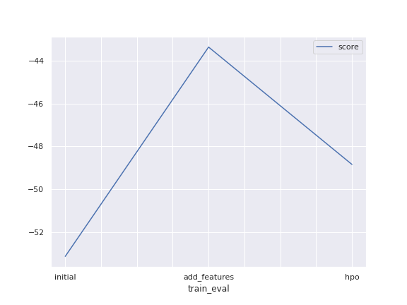
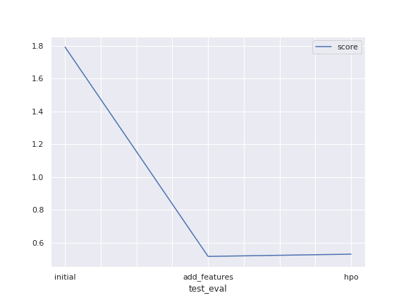

# Report: Predict Bike Sharing Demand with AutoGluon Solution

BARGAV JAGATHA

## Initial Training
### What did you realize when you tried to submit your predictions? What changes were needed to the output of the predictor to submit your results?

Trained the model with no feature engineering and no hyperparameter tuning. Got the score of 1.79 on submission. Some additional features and hyperparameter optimization may yield better results.

### What was the top ranked model that performed?
WeightedEnsemble_L3 to be top ranked model on initial training.

## Exploratory data analysis and feature creation
### What did the exploratory analysis find and how did you add additional features?
Dividing datetime column to month, hour, day and dayofweek features may capture some seasonality or trend. So on adding those features, observing histograms, those features are expected to give some better score. So with the help of pandas, parsed the datetime column first and created those four features mentioned. Also observed some relation between hour and demand. So created another feature hour_bucket depending on the hours where demand is higher or lower.

### How much better did your model preform after adding additional features and why do you think that is?
Adding those features really helped. Gave the score of 0.52 on submission. 

## Hyper parameter tuning
### How much better did your model preform after trying different hyper parameters?
Hyperparameter tuning didn't improve the score. Turned out that adding more features indeed made our model robust than trying different hyperparamer config on it. 

### If you were given more time with this dataset, where do you think you would spend more time?
There can be better set of hyperparameters (even individual model wise). I can spend more time on trying them. I can increase my search space of hyperparameters. 

### Create a table with the models you ran, the hyperparameters modified, and the kaggle score.
|model|hpo1|hpo1|hpo3|score|
|--|--|--|--|--|
|initial|time_limit|presets| |1.79|
|add_features|time_limit|presets| |0.52|
|hpo|num_trials|nn config|gbm config|0.53|

### Create a line plot showing the top model score for the three (or more) training runs during the project.

### Create a line plot showing the top kaggle score for the three (or more) prediction submissions during the project.

## Summary
This is a simple regression problem where the goal is to build a model that predicts the demand in a particular hour given some features and historical data to train on. Since this is tabular dataset, we used TabularPredictor from Autogluon which provides top most algorithms best suited for those kind of problems. Initially I trained the model with no changes in data. Later I have used the datetime attribute in feature set to create new features such as day, hour and month. This is a part of feature engineering and this is where also the exploratory analysis comes handy. Also tried different hyperparameter configurations, but they gave me the score same as the previous altogether.
